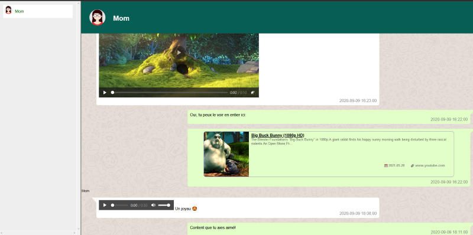

# whatsapp-archive

Format your exported WhatsApp conversation in HTML.

Use the [Saving your chat history][saving] instructions to export your chat
history in Google Drive or One Disk.

Requirements:

   * python3-dateutil (on Debian)
   * python2-jinja2
   * wget

[saving]: https://faq.whatsapp.com/en/android/23756533/?category=5245251

The export from WhatsApp is a very poor. It is also localisation dependent. 
A French export will not be the same as Uk export, nor an US. For my export, 
I change my android setting to US English.
Another issues, in Android at least, there is a size limitation of the archive. 
It is not very well documented.
For me, on the 28th of May 2021, this limitation was around 14MB. 
So you can export the archive without media to have the whole structure. 
The problem of this archive is that every media tag will be replaced by (media ommited).
if you export with media, the chat will go until ~14Mb of archive is filled.
So if you have a video, the archive will contain only a few days.
My export solution is destructive :

 * Step 0: Switch the Language Setting to US English on your Android device.
 * Step 1: I export the archive without media in **GoogleDrive\Archive\folder0\**
  You will have: **WhatsApp Chat with Mom.txt**
* Step2: I export the archive with media in **GoogleDrive\Archive\folder1\**
  You will have: **WhatsApp Chat with Mom.txt** + some media.
  Open this **"WhatsApp Chat with Mom.txt"** and check until when it goes.
  In WhatsApp, delete all exported media.
* Step 3: I export the archive with media in **GoogleDrive\Archive\folder2\**
  and so on until I reached the first day of chat.
* Step X+1: I merge the file **GoogleDrive\Archive\folder0\WhatsApp Chat with Mom.txt**
 with **GoogleDrive\Archive\folder1\WhatsApp Chat with Mom.txt** and **GoogleDrive\Archive\folder2\WhatsApp Chat with Mom.txt** and ...
 to build an full archive with every media tag included. I have used [WinMerge](https://winmerge.org/) for this task. On linux, you can use [Kompare](https://apps.kde.org/kompare/) or [Meld](https://meldmerge.org/).
* I put all the media + the consolidated "WhatsApp Chat with Mom.txt" in one folder call by the name of the chat "Mom".
* I save the avatar picture of the chat and save it in the folder "avatar" with the name of the chat "Mom.jpg"

I do these for every chat.

Then on Linux, run this in shell. On Windows, run this in cmd.

    python3 ./whatsapp_archive.py -i "mom/WhatsApp Chat with Mom.txt" -o "mom/index.html" -m "My Whatsapp username"

Add a line in the **./index.html** between \<UL\>\<\/UL\>:

````HTML
   <!- Mom --><li><a href="Mom/index.html" target="chat_frame"><span class="label">Mom</span></a></li>
`````

The result will look like these:



## Known Issues/Bugs:

If there is a multline chat with some numbers, like phone number, at the beginning of the line, the parser crashes. Edit the text so the line doesn't start with a number

## Used resources

* the main python codes comes from [https://github.com/automaciej/whatsapp-archive](https://github.com/automaciej/whatsapp-archive])
* the Mom picture comes from [https://freesvg.org/by/birgitlachner](https://freesvg.org/by/birgitlachner)
* the popup javascript comes from [https://bqardi.dk/tutorials/js/image-popup/image-popup.php](https://bqardi.dk/tutorials/js/image-popup/image-popup.php)
* [https://projects.verou.me/bubbly/](https://projects.verou.me/bubbly/) helps me creating the CSS for the bubble.
* ["Generating Link Preview" Article on Alan Xiang's Blog](https://www.alanshawn.com/tech/2020/03/25/link-preview.html) helps me creating the link preview.

Thank to all of them for sharing their knowledge.

